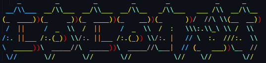

## Hi there 👋

<table style="border-radius: 8px;">
<tr>
<th>🔭 I’m currently working with</th>
<th>🌱 I’m currently learning </th>
</tr>
<tr>
<td>
  
| Category           | Subcategories          |
|--------------------|------------------------|
| Linux              | Debian, Shellscripting |
| Networkengineering | Cisco iOS              |
| Containers         | Docker                 |
| Webapplications    | API                    |
| C++                | OOP, Qt, QML           |
| Python             | Qt, Django, Jupyter    |
| Javascript         | React                  |
| Opensource         |                        |
    
</td>

<td>
  <ul>
    <li>Webapplications</li> 
    <li>C++ </li>
    <li>Cybersecurity</li>
    <li>Network Engineering</li>
    <li>Architecture and Systemmodelling</li>
  </ul>  
</td>
</tr>
</table>

- ⚡ Fun fact: Clouds are constantly changing!

- 📫 How to reach me: ...
  - coc0nut@protonmail.com
 
<!--
**coc0nut/coc0nut** is a ✨ _special_ ✨ repository because its `README.md` (this file) appears on your GitHub profile.

Here are some ideas to get you started:

- 👯 I’m looking to collaborate on ...
- 🤔 I’m looking for help with ...
- 💬 Ask me about ...

- 😄 Pronouns: ...

-->
